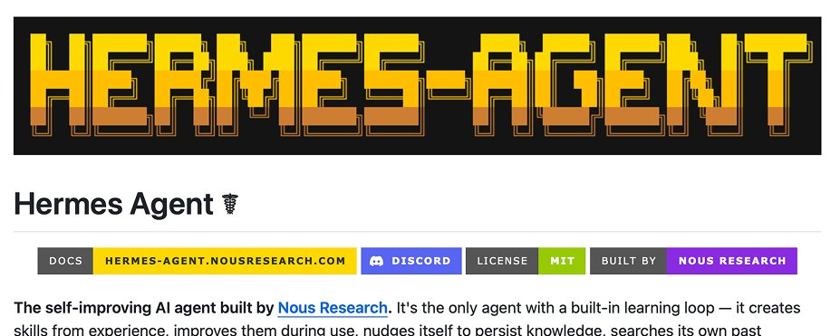

# The Hermes Agent clearly explained (how to use it)
**Author:** The Startup Ideas Podcast (SIP) 🧃 (@startupideaspod)
**Source:** https://x.com/startupideaspod/status/2046310040207016342
**Date:** 2026-04-20
**Saved:** 2026-04-21

## Source Metadata
- **Author:** SIP Podcast — Greg Isenberg. "Get startup ideas and practical tutorials on AI tools that make you more money and build your business."
- **Engagement:** 161K views (inferred), 20 reposts, 151 likes, 377 bookmarks, 1 reply
- **Article Type:** X Article — Podcast episode breakdown with screenshots
- **Cover Image:** 1360x544px, blue-themed cover graphic
- **Inline Images:** 8 screenshots embedded (behind X login wall - not downloadable)

---

## Full Article Text

Imran breaks down what he runs, how he installed it, and the exact ideas he's building with it.

## Why he left OpenClaw

Three problems kept stacking up:

- **No built-in memory.** He kept telling it the same things over and over.
- **The gateway needed restarting.** One day, once an hour.
- **Token spend with no visibility.** He had no idea what was burning money.

He tried Nebula first. Good for an AI coworker. Wrong fit for personalized workflows that learn over time.

Then Hermes.

## What Hermes does differently

**Built-in memory.** Every task it completes successfully gets written to its own memory. It gets better the longer you use it.

**Searchable history.** It uses a standard SQLite database. If it forgot to save something (like an API key you passed it) it can search its logs and find it.

**Stability.** Imran hasn't restarted it in over a week.

**40+ tools pre-installed.** Browser, web search, cron jobs, image generation, home assistant. You don't hunt for tools.

**Skills pre-installed.** On a MacBook, that means Apple Notes, Apple Reminders, Find My, iMessage. Ready on install.

## Install (Mac, Linux, or Windows Subsystem for Linux)

One line from the Hermes Agent docs on the new research website.

First time installing a dev tool on Mac? You'll need Xcode developer tools first: `xcode-select --install`.

Paste the install command. Let it run. You can skip the onboarding.

The one command to learn: `hermes model`. This is where you see every provider and every model available out of the box.

## How he dropped token spend by 90%

Two moves.

**One:** Use OpenRouter. It shows every model with clear per-token pricing. It rotates free models weekly. (When the episode was recorded, NVIDIA's NemoTron was free.)

**Two:** Turn repeat tasks into code. If you run the same task daily, have the agent write the code once. After that the task is deterministic. No agent in the loop. No tokens spent.

**His numbers: around $130 every five days down to around $10 every five days. Same capabilities.**

## Security setup

You can ask Hermes to audit its own setup: "Is this secure? Tell me why or why not."

It'll check for keys in plain text, weak firewall config, exposed secrets.

Three run modes:

- **Bare metal** (what Imran uses, with daily updates)
- **Docker container** (isolated from your files)
- **Modal** (serverless)

## The Android install (and why it matters)

You install it with a script, same idea as the computer install. Two extra apps needed:

- **Termux** (a terminal inside Android)
- **Termux API** (available on F-Droid, gives the agent access to phone sensors: battery, Wi-Fi, volume, camera, brightness, vibration)

Why bother? Because a cheap Android with a SIM card becomes an always-on, low-power dedicated agent device. No sold-out Mac Mini required.

What it unblocks:

- Post to social from a real device (not through a scheduler API that nerfs reach)
- Read SMS directly
- Automate 2FA codes coming in via text

Imran runs one on a Solana Seeker Android phone. He named it Cookie Monster. (All his agents are named after Muppets.)

## How to actually use it (the part most people skip)

Imran's pattern: solve personal problems first. That's how you learn the paradigm.

His first real win was dinner. He recorded an eight-minute Telegram voice note walking through every ingredient in his pantry. Now the agent sends him three recipes a day based on what's there and his fitness goals.

Small problem. Big mental-load reduction.

Other things already running for him:

- **Morning Gmail triage** (deletes junk, unsubscribes from useless lists, returns a digest of what matters)
- **Expense reports**
- **An Obsidian vault the agent organizes itself**

On Obsidian: he wasn't a user before. Now it's his home dashboard. Markdown files the agent manipulates every morning. Today's tasks, this week's priorities, upcoming travel, work, personal. All organized by the agent.

He didn't design this. **The agent built it after about 20 days of use.** Imran thinks 7 days of consistent use gets you most of the way there.

## The prompts he runs on himself

He meta-prompts the agent at the end of each day. Ask it:

- What have I been procrastinating on?
- What's the most important thing to work on today?
- What tasks am I doing every day that I should automate?
- What's one tool you can build me tonight that would make my life easier tomorrow?
- Is there anything important today that I missed?

These feel obvious once you read them. Most people never ask them.

## One vs many agents

Imran runs four. He's a tinkerer. He thinks the real answer is one or two: one personal, one work.

Reason: if you work at a Fortune 500, they won't let you run a personal agent stuffed with private data on a work machine. Splitting keeps it clean, same way a to-do app splits personal and work lists.

**Cron jobs vs sub-agents:** he runs his recurring tasks as cron jobs, not sub-agents. Sub-agents let you assign cheaper models to cheaper tasks (a Gmail triage sub-agent can run on a small model). Both work. The field is still figuring it out.

## Skills worth installing

- **Obsidian skill** (even if you don't use the Obsidian CLI)
- **G-Stack by Gary Tan.** Originally built for Cloud Code. Takes the YC startup process (weekly iteration, the right questions, code-level decisions) and bolts it onto your agent. It's free.
- **Honcho dev memory skill** (helpful because Hermes has memory limits and smaller context helps)
- **Your own.** Bank statements, personal finance, fitness. Build for what you already pay for.

## Two non-negotiables

1. **Update it every night.** It's still beta. Imran was 535 commits behind after nine days without updating.
2. **Lock it down.** Set up Telegram or WhatsApp access. Install Tailscale so your phone and computers sit on the same virtual network, then SSH in from anywhere.

## The bigger idea

Learning to use a personal agent isn't the skill. It's becoming the requirement.

Imran works at a fund. Because his agent handles the background work, he talks to 20–30% more founders. Better signal. Better deal flow. Better returns.

The point isn't the tool. It's what the tool clears off your plate.

Customizing your agent isn't the skill. Getting work done with it is.

## Closing thoughts:

**Hermes Agent is like 90s tuner car culture. Find the parts. Bolt them on. Make it yours. But remember what you're optimizing for. Not the car. The place you're driving to.**

Follow Imran at @imranye.

---

## 📋 Summary

This SIP podcast breakdown features Imran (from a fund) sharing his complete Hermes Agent setup, migration story from OpenClaw, and real-world workflows.

### Why He Left OpenClaw
- No built-in memory (kept repeating instructions)
- Gateway crashing daily
- No visibility into token burn

### The 90% Cost Reduction
$130/5 days → $10/5 days through two moves:
1. OpenRouter (clear pricing, free model rotation)
2. Convert repeat tasks to deterministic code (no agent in the loop)

### Android Agent Install
Termux + Termux API turns a cheap Android phone into always-on agent. Named "Cookie Monster." Unlocks:
- Social posting from real device (avoids API nerf)
- SMS reading + 2FA automation
- Phone sensor access (battery, Wi-Fi, camera, etc.)

### How to Actually Use It
Start with personal problems, not business. Imran's first win: dinner planning from a Telegram voice note of his pantry. Agent now sends 3 recipes/day based on fitness goals.

The agent built his Obsidian dashboard after 20 days of use — he didn't design it himself.

### 🚀 Hermes Angle

**Direct overlap with what you already run:**
- Your 4-layer memory system solves the exact "no memory" problem Imran had with OpenClaw
- Your gateway health cron already handles the stability issue (6hr checks)
- You're already using the "cron jobs > sub-agents" approach Imran recommends

**Takeaway for Junaid:** The Android install pattern is interesting — cheap Android + Termux + Tailscale = always-on agent device. Could be useful for field agent scenarios in your FieldAgent AI product (technicians with always-connected agent on their phones).

The "90% cost reduction through code conversion" is exactly the pattern your skill system enables. Repeat tasks become skills, skills become deterministic, tokens drop.

**Imran's meta-prompts are gold:** End-of-day agent prompts (procrastination check, automation candidates, tomorrow's tools) could be a feature add to OttoManagerPro for shop owners.
